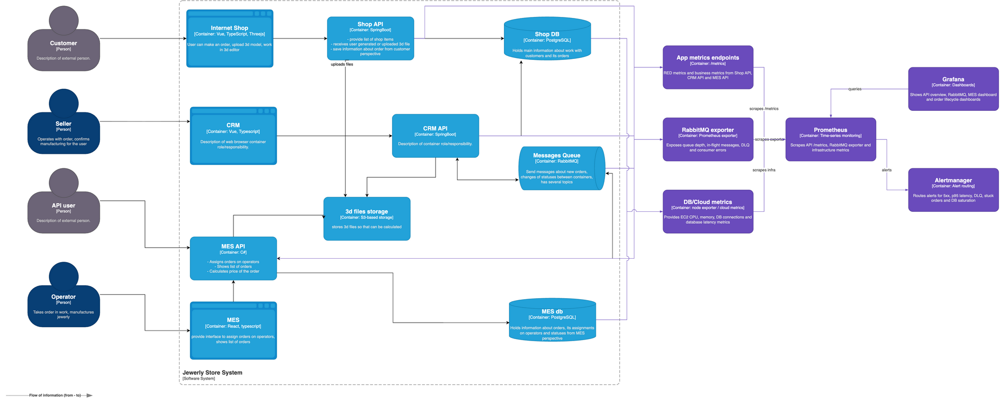

# Выбор и настройка мониторинга в системе

## Мотивация

Яндекс Метрика покрывает только часть B2C-поведения и не видит B2B API, RabbitMQ, backend latency, DLQ, состояние баз и MES dashboard. Мониторинг нужен, чтобы управлять ростом нагрузки, видеть деградацию до жалоб клиентов и связывать технические симптомы с бизнес-показателями: просроченными заказами, потерянными заказами и временем обработки.

## Выбор подхода к мониторингу

| Часть системы | Подход | Почему |
| --- | --- | --- |
| Shop API, CRM API, MES API | RED | Для HTTP API важны rate, errors, duration |
| RabbitMQ | USE + бизнес-метрики очередей | Очередь является критичной интеграцией и должна показывать utilization/saturation/errors |
| EC2 instances и managed PostgreSQL | USE | Для инфраструктуры важны utilization, saturation, errors |
| Order lifecycle | Golden Signals + бизнес SLI | Нужно видеть latency, traffic, errors и saturation бизнес-процесса |

## Метрики

| Метрика | Компонент | Labels | Зачем |
| --- | --- | --- | --- |
| RPS | Shop API, CRM API, MES API | service, endpoint, method, status | Видеть рост нагрузки и горячие endpoint |
| Latency p50/p95/p99 | Shop API, CRM API, MES API | service, endpoint | Видеть деградацию до жалоб |
| HTTP 5xx/4xx | Все API | service, endpoint, status | Отделить ошибки клиента от ошибок сервиса |
| CPU и memory utilization | Все API instances | service, instance | Найти насыщение и необходимость масштабирования |
| DB connections | Shop DB, MES db | database | Выявить исчерпание пула |
| DB latency | Shop DB, MES db | database, query_group | Найти тяжелые чтения dashboard |
| RabbitMQ in-flight messages | Messages Queue | queue, routing_key | Видеть накопление необработанных сообщений |
| RabbitMQ DLQ messages | Messages Queue | queue | Видеть потерянные или неразобранные события |
| Order status age | Order lifecycle | status, source_system | Видеть зависшие заказы |
| Price calculation duration | MES API | complexity_bucket | Контролировать долгие расчеты 3D-моделей |
| MES dashboard load time | MES/MES API | status_filter, page_size | Контролировать операторский сценарий |
| Partner API request rate per client | MES API | client_id, endpoint | Обнаружить перегрузку от партнеров |

## План действий

1. Поднять Prometheus-compatible time-series хранилище и Grafana.
2. Инструментировать Shop API, CRM API и MES API `/metrics`.
3. Подключить RabbitMQ exporter.
4. Подключить node/exporter или cloud metrics для EC2 и managed PostgreSQL.
5. Добавить business metrics для переходов статусов заказа.
6. Настроить Grafana dashboards: API overview, RabbitMQ, MES dashboard, order lifecycle.
7. Настроить alert rules для 5xx, latency p95, DLQ, in-flight growth, stuck orders, DB saturation.

## Показатели насыщенности и реакция

| Сигнал | Порог | Реакция |
| --- | --- | --- |
| MES API CPU > 75% 10 минут | Warning | Добавить инстанс или ограничить тяжелые расчеты |
| MES API p95 latency > 2 секунды 5 минут | Critical | Инцидент, включить rate limiting для B2B API |
| RabbitMQ DLQ > 0 5 минут | Critical | Инцидент интеграции, разбор причины и replay |
| In-flight messages растут 15 минут | Warning | Проверить consumer lag и масштабировать consumers |
| Order в статусе SUBMITTED > 30 минут | Critical | Проверить расчет цены и RabbitMQ delivery |
| MES db connections > 80% pool | Warning | Проверить dashboard queries и connection pool |

## Предлагаемая схема

См. `alexandrite_monitoring_c4.drawio`, PNG-экспорт: `alexandrite_monitoring_c4.png`. Новые элементы: Prometheus, Grafana, RabbitMQ exporter, app metrics endpoints, DB/cloud metrics, alert manager.

