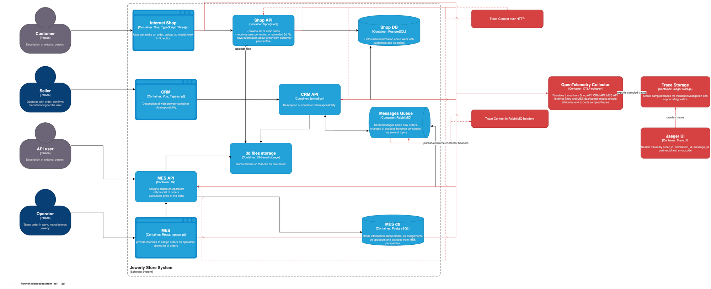
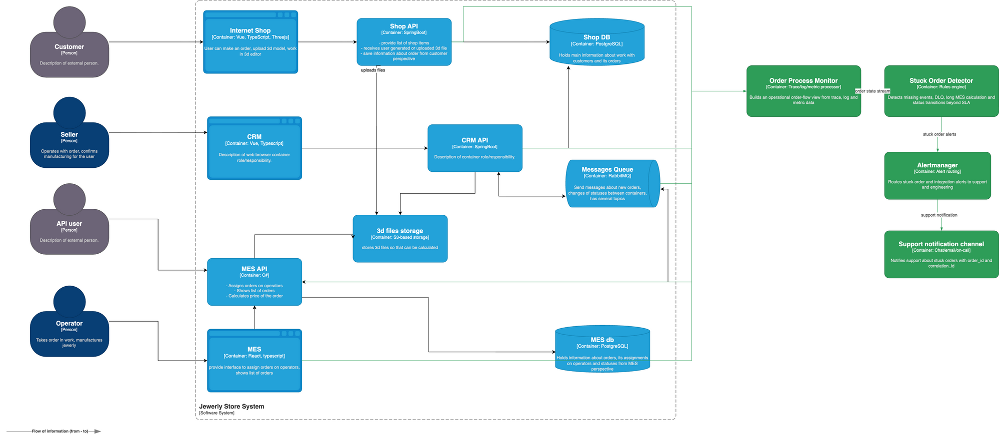

# Архитектурное решение по трейсингу

## Контекст и цель

В Alexandrite заказ проходит через несколько систем: Internet Shop, Shop API, CRM API, MES API, RabbitMQ, S3, базы данных и MES dashboard. Сейчас команда видит, что часть заказов находится в непонятном состоянии или зависает внутри IT-ландшафта, но не может быстро определить, где именно остановилась обработка.

Цель решения - добавить end-to-end трейсинг order-flow, чтобы поддержка и инженеры могли по `order_id` или `correlation_id` восстановить путь заказа, увидеть задержку на каждом участке и отделить техническую ошибку от нормального долгого расчета 3D-модели.

Артефакты:

- [alexandrite_tracing_c4.drawio](alexandrite_tracing_c4.drawio) и [alexandrite_tracing_c4.png](alexandrite_tracing_c4.png) - C4-диаграмма с компонентами трейсинга. Новые элементы и связи выделены красным.
- [alexandrite_order_monitoring_c4.drawio](alexandrite_order_monitoring_c4.drawio) и [alexandrite_order_monitoring_c4.png](alexandrite_order_monitoring_c4.png) - дополнительная C4-диаграмма мониторинга процесса заказа на основе трейсинга. Новые элементы и связи выделены зеленым.
- [README.md](README.md), директории [k8s](k8s), [services](services) и screenshot [screenshots/jaeger-trace.png](screenshots/jaeger-trace.png) - практический MVP с OpenTelemetry и Jaeger.

## Анализ системы и точки трейсинга

Трассировать нужно не все операции подряд, а границы между системами, очередями и состояниями заказа. В этих местах заказ может потеряться, зависнуть или стать невидимым для следующего участника процесса.

| Система | Что трассировать | Где заказ может сломаться или зависнуть |
|---|---|---|
| Internet Shop | создание заказа, выбор или загрузка 3D-модели, вызов Shop API | пользователь отправил заказ, но Shop API не получил запрос или вернул ошибку |
| Shop API | прием заказа, запись в Shop DB, сохранение `model_file_id`, публикация события в RabbitMQ | заказ записан не полностью, событие не опубликовано, файл модели недоступен |
| CRM API | получение нового заказа, подтверждение продавцом, смена статуса, публикация статуса в RabbitMQ | заказ ожидает ручного действия, статус не отправлен дальше, событие ушло в retry/DLQ |
| MES API | прием B2B/API-заказа, consume события из RabbitMQ, расчет стоимости, чтение 3D-файла из S3, запись в MES DB | расчет завис, сообщение не обработано, файл модели не читается, статус не обновлен |
| RabbitMQ | publish/consume, ack/nack, retry, DLQ, latency очередей | сообщение опубликовано, но не обработано или ушло в DLQ |
| S3 | загрузка и чтение 3D-файла по `model_file_id` | расчет MES не может начаться из-за ошибки доступа, таймаута или отсутствующего файла |
| Shop DB и MES DB | запись и чтение заказа в рамках бизнес-операций | заказ есть в одной системе, но не появился в другой, запись завершилась ошибкой |
| MES dashboard | загрузка списка заказов, сортировка newest first, открытие карточки заказа | оператор не видит новый или проблемный заказ, хотя upstream-сервисы его обработали |

Для расчета стоимости в MES API нужен отдельный span `mes.calculate_price`. Нормальное время расчета - 2-3 минуты, для сложных моделей - до 30 минут. Поэтому длинный span сам по себе не считается инцидентом; инцидентом будет превышение SLO, техническая ошибка или отсутствие следующего статуса после завершения расчета.

### Данные в traces

| Данные | Назначение |
|---|---|
| `trace_id`, `span_id`, `parent_span_id` | связь всей цепочки и отдельных операций |
| `order_id` | основной ключ поиска конкретного заказа |
| `correlation_id` | сквозная связь trace, логов и бизнес-событий |
| `customer_type` | разделение B2C/B2B и партнерских заказов |
| `source` | источник заказа: shop, crm, partner_api, mes_dashboard |
| `partner_id` | диагностика проблем конкретного B2B-партнера без персональных данных |
| `message_id` | связь publish и consume операций в RabbitMQ |
| `queue` | определение очереди, retry-очереди или DLQ |
| `status_from`, `status_to` | анализ перехода заказа между статусами |
| `calculation_type` | тип расчета: uploaded_model, generated_model, manual_recalc |
| `model_file_id` | безопасная ссылка на объект модели без содержимого файла |
| `error_code` | группировка технических и бизнес-ошибок |
| `service.name`, `deployment.environment`, `http.route`, `http.status_code`, `db.system`, `messaging.system`, `messaging.destination.name` | стандартные OpenTelemetry semantic attributes для поиска и фильтрации |

В traces нельзя писать ФИО, телефон, email, адрес, платежные данные, сырые SQL-параметры, presigned URL и содержимое 3D-моделей.

## Мотивация

Трейсинг нужен, чтобы убрать слепые зоны в обработке заказов. Сейчас расследование идет по отдельным логам сервисов и очередей, а состояние заказа приходится восстанавливать вручную. Если заказ завис между CRM, MES и RabbitMQ, команда тратит время не на исправление причины, а на поиск места отказа.

После внедрения трейсинга компания получит:

- быстрый поиск полного пути заказа по `order_id` или `correlation_id`;
- понимание, на каком сервисе, очереди или внешнем ресурсе заказ остановился;
- отделение технических ошибок от нормального долгого расчета 3D-модели в MES;
- снижение времени расследования инцидентов по заказам;
- основу для автоматического мониторинга stuck orders и алертинга.

| Метрика | Тип | Ожидаемый эффект |
|---|---|---|
| MTTR по инцидентам с заказами | техническая | уменьшится время от обращения поддержки до локализации проблемного сервиса или очереди |
| Доля заказов, зависших дольше SLO | техническая/бизнес | снизится количество заказов без понятного следующего статуса |
| End-to-end latency заказа по этапам `created -> confirmed -> price_calculated -> manufacturing_started` | техническая/бизнес | станет видно, какой этап дает основной вклад в задержку |
| Доля инцидентов, где root cause найден за заданное время | техническая | вырастет процент расследований с понятным `trace_id` и причиной |
| Количество обращений поддержки и B2B-партнеров по статусу заказа на 100 заказов | бизнес | снизится число повторных обращений из-за неизвестного состояния заказа |

## Предлагаемое решение

Базовая схема взята из исходной C4-диаграммы Alexandrite из материалов курса и доработана под трейсинг.

Решение строится на OpenTelemetry SDK в сервисах, OpenTelemetry Collector как единой точке приема телеметрии и Jaeger/Trace Storage как интерфейсе расследования инцидентов.

### Компоненты и технологии

1. Подключить OpenTelemetry SDK и auto-instrumentation в Internet Shop, Shop API, CRM API, MES API и MES dashboard.
2. Добавить ручные spans вокруг бизнес-операций: `order.create`, `order.confirm`, `order.status_change`, `mes.calculate_price`, `model.upload`, `model.read`, `dashboard.orders.load`.
3. Пробрасывать W3C Trace Context в HTTP-заголовках `traceparent` и `tracestate`.
4. Пробрасывать trace context через RabbitMQ message headers: `traceparent`, `tracestate`, `correlation_id`, `order_id`, `message_id`, `queue`, `source`.
5. Отправлять traces из сервисов по OTLP в OpenTelemetry Collector.
6. В Collector настроить masking/drop опасных атрибутов, resource enrichment и tail sampling.
7. Хранить traces в Trace Storage и просматривать их через Jaeger UI.

### Диаграмма базового решения

На диаграмме красным выделены новые компоненты и связи: OpenTelemetry SDK/auto-instrumentation в сервисах, OpenTelemetry Collector, Trace Storage, Jaeger UI и потоки отправки traces.

- [alexandrite_tracing_c4.drawio](alexandrite_tracing_c4.drawio)
- [alexandrite_tracing_c4.png](alexandrite_tracing_c4.png)

### Порядок внедрения

| Этап | Что сделать | Результат |
|---|---|---|
| 1 | Инструментировать Shop API, CRM API, MES API и RabbitMQ producer/consumer | появляется end-to-end trace основного order-flow |
| 2 | Добавить spans для S3, DB и расчета MES | видно, где задержка: файл, БД, очередь или расчет |
| 3 | Подключить OpenTelemetry Collector и Jaeger | команда получает единый интерфейс поиска trace |
| 4 | Подключить Internet Shop и MES dashboard | можно связать пользовательское действие и операторский UI с backend-chain |
| 5 | Настроить sampling, retention, masking и RBAC | решение становится пригодным для production |

Практический MVP OpenTelemetry + Jaeger находится в [README.md](README.md). В нем два сервиса передают trace context, отправляют spans в Jaeger и подтверждают связь запроса через screenshot [screenshots/jaeger-trace.png](screenshots/jaeger-trace.png).

### Автоматический мониторинг процесса заказа и алертинг

На базе trace/log/metric data можно добавить Order Process Monitor. Он не заменяет сервисы, а строит операционную витрину состояния заказов и автоматически ищет зависшие процессы.

Компоненты:

- `Order Process Monitor` читает trace summaries, бизнес-логи и метрики очередей/статусов.
- `Stuck Order Detector` применяет правила зависания заказа.
- `Alertmanager` маршрутизирует уведомления.
- `Support notification channel` отправляет уведомления поддержке и ответственным инженерам.

Минимальные правила:

| Правило | Источник данных | Реакция |
|---|---|---|
| После создания заказа нет consume события CRM/MES | trace + RabbitMQ metrics | alert в поддержку и инженерную команду |
| Сообщение попало в DLQ | RabbitMQ metrics + trace `message_id` | incident для команды интеграции |
| `mes.calculate_price` идет дольше SLO | trace span + business status | предупредить поддержку, проверить MES API и S3 |
| Статус заказа не менялся дольше допустимого окна | traces + business logs | support follow-up по конкретному `order_id` |
| Ошибки одного `partner_id` выше нормы | traces + metrics | контакт с партнером или временное ограничение интеграции |

На дополнительной диаграмме зеленым выделены новые компоненты и связи для мониторинга процесса заказа и алертинга.

- [alexandrite_order_monitoring_c4.drawio](alexandrite_order_monitoring_c4.drawio)
- [alexandrite_order_monitoring_c4.png](alexandrite_order_monitoring_c4.png)

## Компромиссы

| Компромисс | Почему это важно | Решение |
|---|---|---|
| 100% traces всех успешных заказов дорого хранить | объем данных растет вместе с заказами и нагрузкой | tail sampling: 100% ошибок, DLQ и slow traces; доля успешных traces |
| Детальные spans каждой внутренней функции MES дадут шум | расчет 3D-модели может быть долгим и сложным | трассировать ключевые фазы расчета, а не каждую функцию |
| Проприетарные или legacy-компоненты могут не поддержать OpenTelemetry | доработка может быть дорогой или невозможной быстро | использовать wrapper spans, gateway-level tracing и корреляцию через логи |
| Трейсинг не заменяет бизнес-аналитику | traces нужны для расследований, а не для долгосрочных BI-отчетов | долгосрочные агрегаты хранить в метриках, логах и аналитическом хранилище |
| Нельзя писать payload 3D-моделей, PII и SQL-параметры | риск утечки данных и рост стоимости хранения | хранить только безопасные идентификаторы и нормализованные коды ошибок |
| Dashboard может генерировать слишком много коротких traces | частые refresh/list-запросы создают шум | ограничить sampling dashboard-запросов и отдельно хранить slow/error traces |

Трейсинг не принесет пользы, если сервисы не будут передавать `traceparent` и `correlation_id` через HTTP и RabbitMQ: цепочка снова распадется на отдельные события. Поэтому propagation является обязательной частью решения, а не дополнительной оптимизацией.

## Безопасность

Для системы трейсинга нужны отдельные меры защиты, потому что traces могут содержать технические детали внутренних сервисов и бизнес-идентификаторы заказов.

| Мера | Описание |
|---|---|
| Аутентификация | Jaeger UI доступен только сотрудникам компании с актуальной учетной записью |
| Авторизация/RBAC | support видит traces по заказам и статусам; engineers/SRE видят технические детали; admins управляют retention, sampling и настройками |
| Сетевая изоляция | Jaeger UI, Trace Storage и Collector не публикуются наружу, доступ только из внутренней сети или через VPN |
| TLS/mTLS | трафик сервисов к Collector и Collector к Trace Storage шифруется; для production желательно mTLS между внутренними компонентами |
| Маскирование атрибутов | Collector удаляет `customer_name`, `email`, `phone`, `address`, `payment_*`, `model_payload`, `s3_presigned_url`, небезопасный `db.statement` |
| Retention | полные traces хранятся 7-14 дней, error/slow traces - до 30 дней; долгосрочно остаются только агрегаты |
| Sampling | 100% ошибок, DLQ и заказов дольше SLO; ограниченная доля успешных traces |
| Аудит доступа | обращения к Jaeger UI и административные изменения логируются |

Если когда-либо потребуется внешний доступ к trace-информации для партнера, его нельзя давать напрямую в Jaeger. Нужно сделать отдельный support/API-view, который показывает только статус и безопасные поля конкретного заказа партнера.
