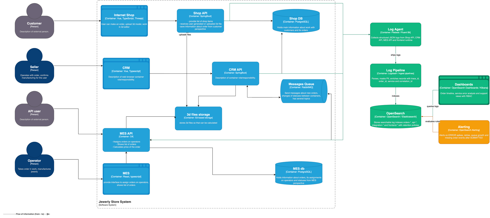

# Архитектурное решение по логированию

## Контекст и цель

Сейчас нестандартные ситуации разбираются со слов клиента: поддержка и разработчики долго восстанавливают, что произошло в сервисах, очередях и базах данных. Логирование должно дать единую историю событий по заказу и сократить время расследования инцидентов.

Цель решения - внедрить структурные логи для order-flow Alexandrite, связать их с трейсингом через `trace_id`/`correlation_id`, обеспечить безопасное хранение и превратить логи в источник анализа, dashboard'ов и алертов.

Артефакты:

- [alexandrite_logging_c4.drawio](alexandrite_logging_c4.drawio) - C4-диаграмма с компонентами сбора и анализа логов.
- [alexandrite_logging_c4.png](alexandrite_logging_c4.png) - PNG-экспорт диаграммы.



## Системы и события для логирования

В первую очередь логи нужны там, где заказ меняет состояние, пересекает границу сервиса или может потеряться в асинхронной обработке. На диаграмме эти источники подключены к `Log Agent`: Shop API, CRM API, MES API и frontend runtime для пользовательских ошибок.

### INFO-логи

| Событие INFO | Системы | Поля |
|---|---|---|
| Создание заказа | Shop API | `timestamp`, `level`, `service`, `event`, `order_id`, `correlation_id`, `trace_id`, `customer_id_hash`, `source`, `status` |
| Загрузка 3D-файла | Shop API | `timestamp`, `order_id`, `correlation_id`, `file_id`, `size_bucket`, `format`, `result` |
| Отправка сообщения в RabbitMQ | CRM API, MES API | `timestamp`, `order_id`, `correlation_id`, `message_id`, `routing_key`, `status_from`, `status_to` |
| Получение сообщения из RabbitMQ | CRM API, MES API | `timestamp`, `order_id`, `correlation_id`, `message_id`, `queue`, `processing_time_ms`, `result` |
| Расчет стоимости по 3D-модели | MES API | `timestamp`, `order_id`, `correlation_id`, `model_complexity_bucket`, `duration_ms`, `result` |
| Изменение статуса заказа | CRM API, MES API | `timestamp`, `order_id`, `correlation_id`, `status_from`, `status_to`, `actor_type` |
| Взятие заказа оператором | MES API | `timestamp`, `order_id`, `correlation_id`, `operator_id_hash`, `status` |
| Отправка заказа | MES API | `timestamp`, `order_id`, `correlation_id`, `shipment_provider`, `result` |
| Ошибка frontend runtime | Internet Shop, CRM, MES | `timestamp`, `service`, `page`, `route`, `correlation_id`, `error_code`, `browser_family` |

### Другие уровни логирования

| Уровень | Когда использовать | Примеры |
|---|---|---|
| `DEBUG` | Только в dev/release или временно при расследовании инцидента | детали запроса без PII, diagnostic context, feature flags |
| `INFO` | Нормальные бизнес-события и успешные переходы заказа | `OrderCreated`, `OrderStatusChanged`, `RabbitMessagePublished` |
| `WARN` | Ситуация требует внимания, но операция может восстановиться | retry, long processing, circuit breaker half-open, рост очереди, медленный расчет |
| `ERROR` | Операция завершилась ошибкой или заказ не может перейти дальше | отказ БД, недоступность RabbitMQ, ошибка S3, потеря сообщения, невозможность обновить статус |
| `FATAL` | Сервис не может продолжать работу | невозможность стартовать из-за конфигурации или недоступной обязательной зависимости |

## Мотивация

Логи дадут поддержке и инженерам факты вместо пересказа клиента: какие сервисы обработали заказ, какие статусы были выставлены, где произошла ошибка и какой `correlation_id` связывает событие с trace. Для бизнеса это снижает количество долгих ручных разборов и помогает быстрее отвечать B2C-клиентам и B2B-партнерам.

| Метрика | Тип | Ожидаемый эффект |
|---|---|---|
| MTTR по инцидентам с заказами | техническая | снизится время поиска причины проблемы |
| Доля заказов с полной историей событий | техническая/бизнес | вырастет прозрачность order-flow для поддержки |
| Количество ручных эскалаций в инженерную команду | бизнес | снизится нагрузка на разработчиков и поддержку |
| Среднее время ответа поддержки по статусу заказа | бизнес | поддержка быстрее найдет факты по `order_id` |
| Повторные инциденты одного класса | техническая | снизятся за счет поиска паттернов и алертов |

Команда не сможет сразу внедрить полное логирование и трейсинг во всех системах, поэтому приоритет такой:

| Приоритет | Система | Что включить сначала | Почему |
|---|---|---|---|
| 1 | MES API и RabbitMQ producer/consumer | INFO/WARN/ERROR логи, `correlation_id`, `message_id`, `order_id`, `trace_id` | здесь считаются стоимость, меняются производственные статусы и теряются асинхронные события |
| 2 | CRM API | логи переходов статусов, подтверждения заказа, publish/consume событий | CRM связывает продажи и производство, здесь важна история ручных действий |
| 3 | Shop API | создание заказа, загрузка 3D-файла, запись в БД, публикация события | это начало order-flow, без этих логов сложно понять, создан ли заказ корректно |
| 4 | MES dashboard и frontend runtime | error logs, route/page, correlation id, slow UI actions | нужно для жалоб операторов на медленный dashboard |
| 5 | Frontend Internet Shop/CRM | пользовательские ошибки и failed API calls | полезно для UX-диагностики, но не блокирует базовую видимость order-flow |

Трейсинг в этом же порядке нужно включать на межсервисных границах: сначала MES API/RabbitMQ/CRM API/Shop API, затем frontend. Логи и traces должны ссылаться друг на друга через `trace_id`, `span_id` и `correlation_id`.

## Предлагаемое решение

Использовать структурные JSON-логи и централизованный сбор через Log Agent, Log Pipeline, OpenSearch и OpenSearch Dashboards.

Компоненты:

- `Structured logging library` в backend-сервисах и frontend runtime: формирует JSON-логи с единым набором полей.
- `Log Agent` на инстансах или в Kubernetes DaemonSet/sidecar: Filebeat или Fluent Bit собирает stdout/file logs.
- `Log Pipeline`: Logstash, OpenSearch ingest pipelines или Data Prepper парсят, маскируют PII и обогащают записи.
- `OpenSearch`: хранит индексы `orders-*`, `api-*`, `integration-*`, `frontend-*`.
- `OpenSearch Dashboards`: дает support-view по order timeline, технические dashboards для инженеров и SRE.
- `Alerting`: правила для ошибок, retry, аномалий и отсутствующих событий.

Каждый backend добавляет в лог минимум:

```json
{
  "timestamp": "2026-06-07T01:00:00Z",
  "level": "INFO",
  "service": "mes-api",
  "environment": "prod",
  "event": "OrderStatusChanged",
  "order_id": "ord-123",
  "correlation_id": "corr-456",
  "trace_id": "trace-789",
  "span_id": "span-001",
  "status_from": "PRICE_CALCULATED",
  "status_to": "MANUFACTURING_APPROVED",
  "result": "success"
}
```

На диаграмме отражены новые компоненты и связи от источников логов к `Log Agent`, далее к `Log Pipeline`, `OpenSearch`, `Dashboards` и `Alerting`.

Файлы диаграммы:

- [alexandrite_logging_c4.drawio](alexandrite_logging_c4.drawio)
- [alexandrite_logging_c4.png](alexandrite_logging_c4.png)

## Безопасность

В логах запрещены ФИО, телефон, email, адрес, платежные данные, сырые SQL-параметры, presigned URL и содержимое 3D-файлов. Для клиента, оператора и партнера используются hash/surrogate id: `customer_id_hash`, `operator_id_hash`, `partner_id`.

Меры:

- маскирование и drop правил в Log Pipeline для `email`, `phone`, `address`, `payment_*`, `model_payload`, `s3_presigned_url`, небезопасного `db.statement`;
- RBAC в OpenSearch Dashboards: Support видит order timeline без stack traces и чувствительных технических деталей; Developers/SRE видят технические поля; Admins управляют индексами, retention и доступами;
- отдельные роли для prod/release/dev, чтобы доступ к production-логам был ограничен;
- аудит доступа к dashboard'ам и изменениям alert/index policy;
- шифрование трафика от agents до pipeline/storage и шифрование данных в storage;
- запрет логирования request/response body по умолчанию.

## Хранение

Логи разделяются по доменам и срокам хранения:

| Индекс | Что хранит | Горячее хранение | Теплое хранение | Примечание |
|---|---|---|---|---|
| `orders-*` | бизнес-события order-flow | 14 дней | 60 дней | основной индекс поддержки |
| `integration-*` | RabbitMQ publish/consume/retry/DLQ | 14 дней | 60 дней | нужен для расследования потерянных сообщений |
| `api-*` | backend access/error logs | 7 дней | 30 дней | высокий объем, хранить агрегаты дольше |
| `frontend-*` | frontend runtime errors | 7 дней | 30 дней | sampling для шумных событий |
| `security-audit-*` | доступ к логам и административные действия | 30 дней | 180 дней | доступ ограничен администраторам |

Размер shard держать в диапазоне 20-40 GB. Для высокообъемных access logs использовать rollover по размеру и времени, а для долгосрочных отчетов хранить агрегаты, а не сырые логи.

## Анализ логов и алертинг

Система сбора логов должна стать системой анализа: поддержка ищет историю заказа, инженеры видят ошибки сервисов, а алерты реагируют на аномалии до массовых жалоб.

Минимальные dashboard'ы:

- order timeline по `order_id` и `correlation_id`;
- ошибки по `service`, `event`, `error_code`;
- RabbitMQ retry/DLQ по `queue` и `message_id`;
- переходы статусов заказа и задержки между статусами;
- frontend errors для MES dashboard.

Минимальные алерты:

| Алерт | Условие | Реакция |
|---|---|---|
| ERROR spike | рост ERROR по `service` выше baseline за 5 минут | уведомить инженеров сервиса |
| Retry/DLQ growth | рост retry или DLQ по очереди | проверить RabbitMQ consumer и downstream-сервис |
| Missing order event | после `SUBMITTED` нет следующего события дольше SLO | уведомить поддержку и команду order-flow |
| DDoS/API abuse anomaly | резкий рост заказов или ошибок от одного `partner_id`/`source_ip_hash` | ограничить источник, проверить rate limits |
| MES dashboard frontend errors | рост ошибок на route dashboard | проверить release и backend latency |

Аномалии искать по baseline: количество заказов в минуту, доля ошибок на сервис, количество retry, задержки между статусами, частота запросов от одного партнера или IP hash.

## Сравнение технологий

| Критерий | ELK | OpenSearch | Splunk |
|---|---|---|---|
| Лицензия | Elastic License, есть ограничения для self-hosted | Apache 2.0, предсказуемее для self-hosted | проприетарная |
| Стоимость | средняя/высокая, зависит от лицензии и managed-сервиса | ниже для self-hosted, выше операционная ответственность | высокая лицензия и vendor lock-in |
| Managed в облаке | доступен | доступен | доступен |
| Командный опыт | широкий рынок специалистов | похож на ELK, проще переиспользовать опыт | нужна отдельная специализация |
| Масштабирование | хорошее при правильном ILM/sharding | хорошее при правильном ISM/sharding | хорошее, но дорогое |
| Интеграции | Beats, Logstash, APM | Fluent Bit, Data Prepper, OpenSearch Dashboards | богатая экосистема enterprise-интеграций |
| Безопасность/RBAC | зрелая, часть возможностей зависит от лицензии | встроенные security plugin/RBAC | зрелая enterprise-модель |
| Алертинг и аномалии | Kibana alerting, ML в коммерческих вариантах | OpenSearch Alerting, Anomaly Detection | сильные возможности, но высокая цена |

Рекомендация: OpenSearch. Для текущей команды он закрывает поиск логов, dashboard'ы, RBAC, alerting и anomaly detection без дорогого проприетарного стека. Splunk функционально силен, но избыточен и дорог для текущего этапа. ELK технически подходит, но лицензирование менее предсказуемо для self-hosted сценария.
