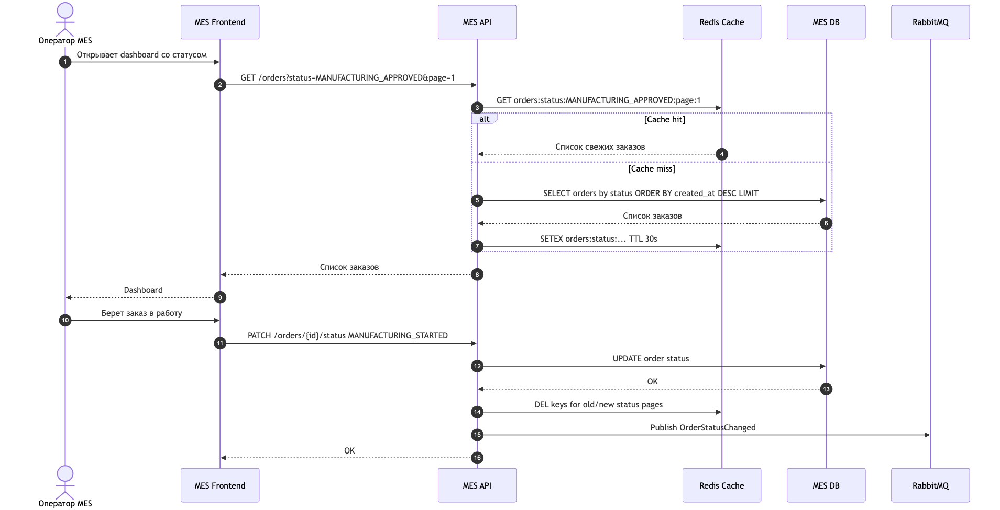
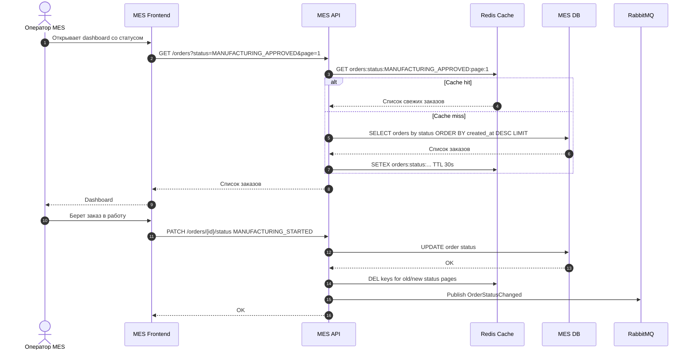

# Диаграмма последовательности кеширования

```mermaid
sequenceDiagram
    autonumber
    actor Operator as Оператор MES
    participant MES as MES Frontend
    participant API as MES API
    participant Cache as Redis Cache
    participant DB as MES DB
    participant MQ as RabbitMQ

    Operator->>MES: Открывает dashboard со статусом
    MES->>API: GET /orders?status=MANUFACTURING_APPROVED&page=1
    API->>Cache: GET orders:status:MANUFACTURING_APPROVED:page:1
    alt Cache hit
        Cache-->>API: Список свежих заказов
    else Cache miss
        API->>DB: SELECT orders by status ORDER BY created_at DESC LIMIT
        DB-->>API: Список заказов
        API->>Cache: SETEX orders:status:... TTL 30s
    end
    API-->>MES: Список заказов
    MES-->>Operator: Dashboard

    Operator->>MES: Берет заказ в работу
    MES->>API: PATCH /orders/{id}/status MANUFACTURING_STARTED
    API->>DB: UPDATE order status
    DB-->>API: OK
    API->>Cache: DEL keys for old/new status pages
    API->>MQ: Publish OrderStatusChanged
    API-->>MES: OK
```
